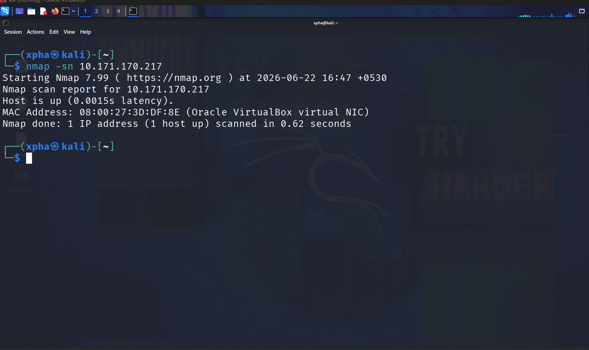
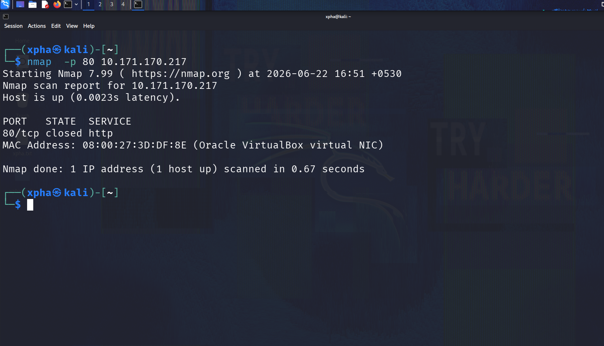
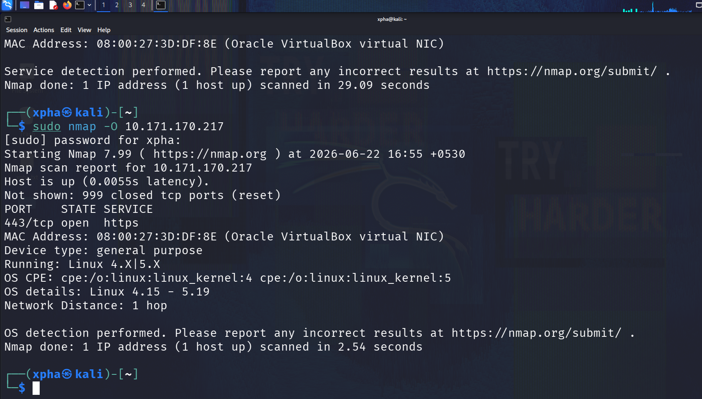

# 🛡️ Network Analysis Lab

## 📖 Network Traffic Analysis & Service Enumeration using Nmap and Wireshark

## 📌 Overview

This project demonstrates a basic SOC Analyst home lab where Nmap and Wireshark were used to perform host discovery, port scanning, operating system detection, and packet analysis in a controlled environment.

---

## 🧪 Lab Environment

### 🛠️ Tools Used

- 🐉 Kali Linux
- 🐧 Ubuntu Server (Wazuh)
- 🛡️ Wazuh
- 🌐 Nmap
- 🦈 Wireshark

---

## 🏗️ Lab Architecture

```text
Kali Linux VM (10.171.170.194)
          |
          |
   Network Communication
          |
          |
Ubuntu Wazuh Server (10.171.170.217)
```

---

## 🎯 Objective

The objective of this project is to:

- ✅ Discover active hosts
- ✅ Identify open ports
- ✅ Enumerate running services
- ✅ Detect the operating system
- ✅ Capture network traffic
- ✅ Analyze network communications

---

## 🛠️ Tools Used

<br>

<br>

<br>

<br>


---

## 🔎 Step 1: Host Discovery

### Command

```bash
sudo nmap -sn 10.171.170.0/24
```

### 🎯 Purpose

- Discover active hosts
- Identify reachable systems

### 📸 Screenshot


### 📝 Observation

- Kali Linux host detected
- Ubuntu Wazuh server detected

---

## 🚪 Step 2: TCP SYN Port Scan

### Command

```bash
sudo nmap -sS 10.171.170.217
```

### 🎯 Purpose

- Identify open TCP ports





### 📝 Observation

- SSH port detected
- HTTPS port detected

---

## 🖥️ Step 4: Operating System Detection

### Command

```bash
sudo nmap -O 10.171.170.217
```

### 🎯 Purpose

- Detect the target operating system

### 📸 Screenshot


### 📝 Observation

- Linux operating system identified

---

## 🦈 Step 5: Network Traffic Capture

Open Wireshark.

Select the active network interface.

Apply the following filter:

```text
ip.addr==10.171.170.217
```

### 📸 Screenshot


### 📝 Observation

- Network packets captured
- Source IP identified
- Destination IP identified

---

## 🧠 Key Skills Demonstrated

- 🌐 Network Scanning
- 🔍 Host Discovery
- 🚪 Port Scanning
- 🖥️ OS Fingerprinting
- 🦈 Packet Analysis
- 📡 Traffic Monitoring
- 🔗 TCP/IP Fundamentals
- 🐧 Linux Fundamentals
- 🛡️ Network Security

---

## 📌 Conclusion

This project demonstrates a SOC Analyst home lab workflow by combining Nmap and Wireshark to perform network reconnaissance and packet analysis in a controlled environment.

The project provides hands-on experience in:

- Identifying active hosts
- Detecting operating systems
- Analyzing network traffic
- Understanding network communication patterns
- Performing basic security analysis in a controlled lab environment

---

## ⚠️ Disclaimer

This project was performed in a personal home lab environment using authorized virtual machines.

All activities were conducted on systems owned and controlled by the author for educational purposes only.
